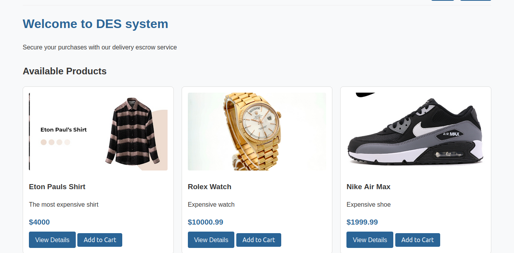
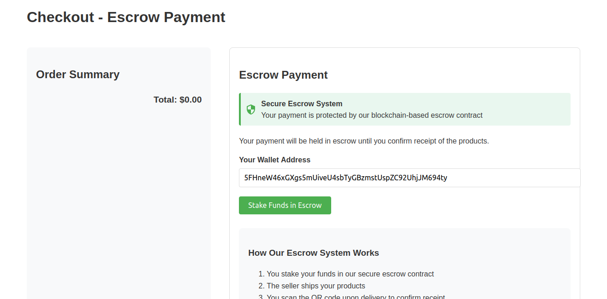
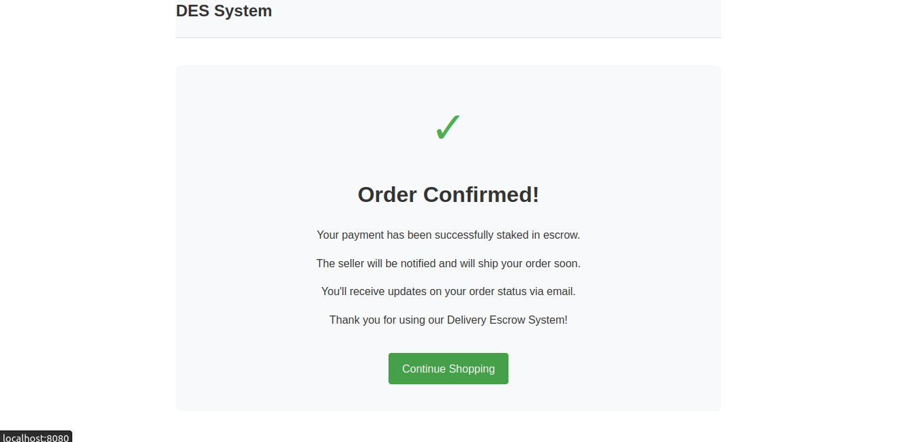
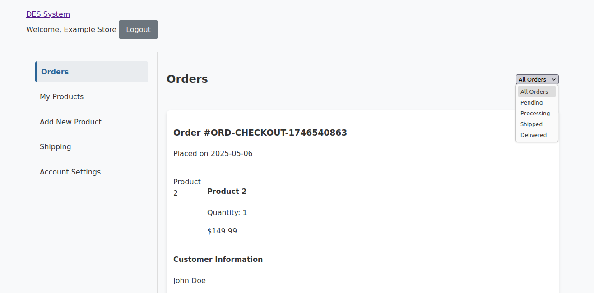
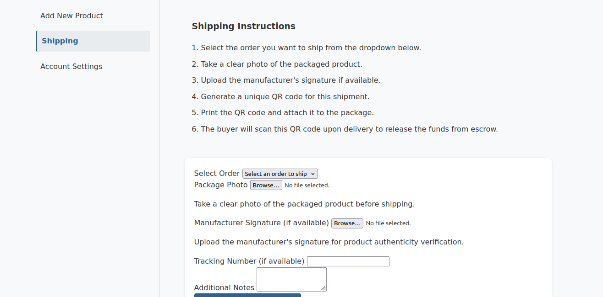

# Delivery Escrow System (DES)

A blockchain-based escrow system for secure e-commerce transactions, ensuring safe delivery and payment for all parties involved.

## Problem Statement

E-commerce transactions often suffer from trust issues between buyers and sellers:
Scammers take this advantage and sell fake products and the buyer ends up losing money
and gets frustrated while the products brand gets tarnished.

- Buyers risk paying for products that never arrive or don't match descriptions or even get scammed.
- Sellers risk shipping products without receiving payment
- Delivery personnel lack incentives for timely and careful handling

The Delivery Escrow System solves these problems by using blockchain technology to create a trustless environment where funds are only released when delivery is made and the correct product is delivered, with built-in dispute resolution mechanisms.

## Solution Overview

DES implements a smart contract-based escrow system that:

1. Holds buyer funds in a secure escrow contract
2. Releases funds only when delivery is made and the correct prosuct is delivered.
3. Distributes payments automatically (to the seller, to the transporter)
4. Provides dispute resolution for problematic transactions
5. Uses QR code scanning for proof of delivery

## Technology Stack

- **Frontend**: HTML, CSS, JavaScript
- **Backend**: Go (Golang)
- **Blockchain**: Substrate/Polkadot (Rust smart contracts)
- **Smart Contract**: Deployed on contracts.onpop.io

## Key Features

### For Buyers
- Browse and purchase products with escrow protection
- Track order status in real-time
- Confirm delivery by scanning QR codes
- Raise disputes for unsatisfactory deliveries

### For Sellers
- List products for sale
- Track order and payment status
- Receive automatic payments upon delivery confirmation
- Participate in dispute resolution

### For Transporters
- Accept delivery assignments
- Submit proof of delivery
- Receive automatic commission upon successful delivery

## Smart Contract Architecture

The escrow smart contract (written in Rust using ink!) handles:

- Fund deposits from buyers
- Proof of delivery submission
- Delivery confirmation
- Automatic fund distribution (to the seller, to the transporter)
- Dispute handling
- Refund processing

## Getting Started

### Prerequisites
- Go 1.22 or higher
- Web browser
- Access to contracts.onpop.io (for blockchain interaction)

### Installation

1. Clone the repository:
```bash
git clone https://github.com/GathangaElijah/delivery-escrow-system.git
cd delivery-escrow-system
```

2. Install dependencies:
```bash
go mod download
```

3. Run the application:
```bash
go run ./backend/cmd/main.go
```

4. Access the application at `http://localhost:8080`

## Project Structure

```
delivery-escrow-system/
├── backend/
│   ├── blockchain/       # Blockchain interaction code
│   ├── cmd/              # Application entry points
│   ├── handlers/         # HTTP request handlers
│   ├── static/           # Static assets (CSS, JS, images)
│   └── templates/        # HTML templates
├── delivery-escrow-contract/
│   ├── lib.rs            # Smart contract code
│   └── Cargo.toml        # Rust dependencies
└── README.md
```

## How It Works

1. **Purchase Flow**:
   - Buyer selects products and proceeds to checkout
   

   

   - Buyer's funds are held in the escrow smart contract
    
    

   - Seller is notified of the purchase and Prepares the product for shipment
    
   
   - Seller prepares the product for shipment
    

2. **Delivery Flow**:
   - Seller prepares the shipment with a unique QR code
   - Transporter picks up and delivers the package
   - Buyer scans QR code upon receipt to confirm delivery

3. **Payment Flow**:
   - Smart contract automatically releases funds upon delivery confirmation
   - 90% goes to the seller, 10% to the transporter
   - All transactions are recorded on the blockchain

4. **Dispute Resolution**:
   - Buyer can raise a dispute if the product is unsatisfactory
   - Dispute resolution process is initiated
   - Funds are held until the dispute is resolved

(**Other parts are coming soon**)

## Security Considerations

- All funds are held in a secure smart contract, not by any single party
- Proof of delivery is cryptographically verified
- Transactions are immutable and transparent on the blockchain
- User authentication protects account access

## Future Enhancements

- Mobile application for easier QR code scanning
- Integration with major e-commerce platforms
- Multi-signature approval for high-value transactions
- AI-powered dispute resolution
- Support for multiple cryptocurrencies and stablecoins

## Contributing

Contributions are welcome! Please feel free to submit a Pull Request.

## License

This project is licensed under the GPL License - see the LICENSE file for details.

## Contact

For questions or support, please contact [Elijah Gathanga](elyg3672@gmail.com).
