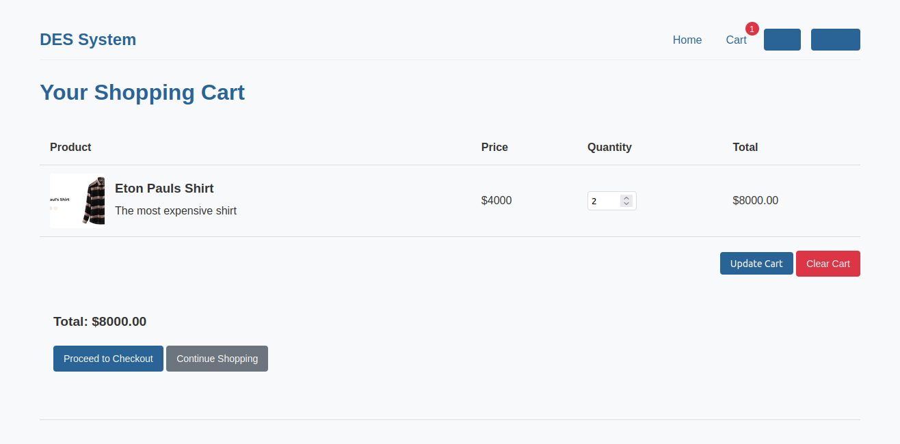

# Project Name

## Delivery Escrow System (DES)


A blockchain-based escrow system for secure e-commerce,freelancing and other service providers transactions, and prevent clients from fraud and scams.


---

## 📌 Table of Contents

- [Overview](#-overview)
- [Features](#-features)
- [Tech Stack](#-tech-stack)
- [Installation](#installation)
- [Usage](#-usage)
- [API Reference](#-api-reference) _(optional)_
- [Contributing](#-contributing)
- [License](#-license)
- [Author](#-author)

---

## 📖 Overview

Most of the time when you are doing business, you will do it with someone you don't know. This brings trust issues especially when it involves monetary transactions. An example of someone who needs to have their products transported to another location, needs assuarance that the goods will arrive safely and securely. To ensure this, you would have to rely on someone you trust. This can be inconvinient when they don't show up. You have to look for other options. In your head you have various questions;
1. Will my product get to the destination safely and securely?
2. How will I know the product has arrived?
3. How would I know the credit score of this new transporter?
and so much more. 
This brings in a risk of losing both money and product. This is where DES comes in, 
This is a **trustless payments protocol** that holds money and releases it once the the agreement has been fulfilled. There is no risk of losing money. You are in control. Incase of any dispute, a resolution is sorted and the transaction succeds.

---

## ✨ Features

- Dual confirmation for delivery
- Proof-of-delivery hash validation
- REST API for off-chain interaction
- Wallet integration (MetaMask, Polkadot.js)
- Built-in conflict resolution logic
- Holds buyer funds in a secure escrow contract
- Releases funds only when delivery is made and the correct prosuct is delivered.
- Distributes payments automatically (to the seller, to the transporter)
- Provides dispute resolution for problematic transactions
- Uses QR code scanning for proof of delivery


---

## ⚙️ Tech Stack

| Layer          | Technology                |
| -------------- | ------------------------- |
| Smart Contract | Rust, ink!                |
| Backend        | Go (net/http)             |
| Frontend       | React  |
| Blockchain     | Polkadot (Substrate)      |
| Other Tools    | Docker, Git, curl         |

---

## 🛠️ Installation

### Prerequisites
- Go 1.22 or higher
- Web browser
- Access to contracts.onpop.io (for blockchain interaction)

````bash
# Clone the repo
git clone https://github.com/GathangaElijah/delivery-escrow-system.git
cd elivery-escrow-system

# Set up backend
go run ./backend/cmd/

# For smart contracts (Ink!)
cd delivery-escrow-contract
cargo contract build
cargo contract deploy

# Frontend setup (if applicable)
cd descrow-frontend
npm install
npm run dev


## Technology Stack

- **Frontend**: HTML, CSS, JavaScript(react)
- **Backend**: Go (Golang)
- **Blockchain**: Substrate/Polkadot (Rust smart contracts)
- **Smart Contract**: Deployed on contracts.onpop.io

## Key Features

### For Buyers
- Browse and purchase products with escrow protection
- Track order status in real-time
- Confirm delivery by scanning QR codes
- Raise disputes for unsatisfactory deliveries

### For Sellers
- List products for sale
- Track order and payment status
- Receive automatic payments upon delivery confirmation
- Participate in dispute resolution

### For Transporters
- Accept delivery assignments
- Submit proof of delivery
- Receive automatic commission upon successful delivery

## Smart Contract Architecture

The escrow smart contract (written in Rust using ink!) handles:

- Fund deposits from buyers
- Proof of delivery submission
- Delivery confirmation
- Automatic fund distribution (to the seller, to the transporter)
- Dispute handling
- Refund processing


## Project Structure

```
delivery-escrow-system/
├── backend/
│   ├── blockchain/       # Blockchain interaction code
│   ├── cmd/              # Application entry points
│   ├── handlers/         # HTTP request handlers
│   ├── static/           # Static assets (CSS, JS, images)
│   └── templates/        # HTML templates
├── delivery-escrow-contract/
│   ├── lib.rs            # Smart contract code
│   └── Cargo.toml        # Rust dependencies
└── README.md
```

````
## How It Works

1. **Purchase Flow**:

- Buyer selects products and proceeds to checkout



- Buyer's funds are held in the escrow smart contract


- Seller is notified of the purchase and Prepares the product for shipment


- Seller prepares the product for shipment


2. **Delivery Flow**:

   - Seller prepares the shipment with a unique QR code
   - Transporter picks up and delivers the package
   - Buyer scans QR code upon receipt to confirm delivery

3. **Payment Flow**:

   - Smart contract automatically releases funds upon delivery confirmation
   - 90% goes to the seller, 10% to the transporter
   - All transactions are recorded on the blockchain

4. **Dispute Resolution**:
   - Buyer can raise a dispute if the product is unsatisfactory
   - Dispute resolution process is initiated
   - Funds are held until the dispute is resolved

(**Other parts are coming soon**)

## Security Considerations

- All funds are held in a secure smart contract, not by any single party
- Proof of delivery is cryptographically verified
- Transactions are immutable and transparent on the blockchain
- User authentication protects account access

## Future Enhancements

- Mobile application for easier QR code scanning
- Integration with major e-commerce platforms
- Multi-signature approval for high-value transactions
- AI-powered dispute resolution
- Support for multiple cryptocurrencies and stablecoins

## Contributing

Contributions are welcome! Please feel free to submit a Pull Request.

## License

This project is licensed under the GPL License - see the [LICENSE](./LICENSE) file for details.

## Contact

For questions or support, please contact [Elijah Gathanga](elyg3672@gmail.com).
